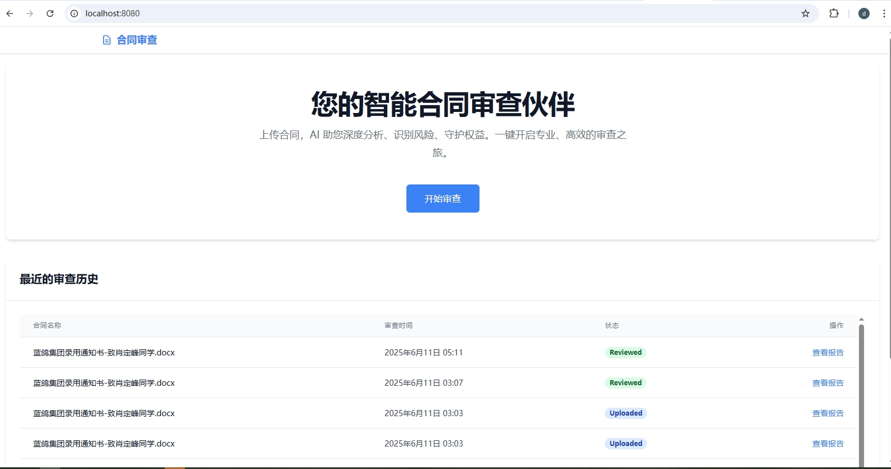
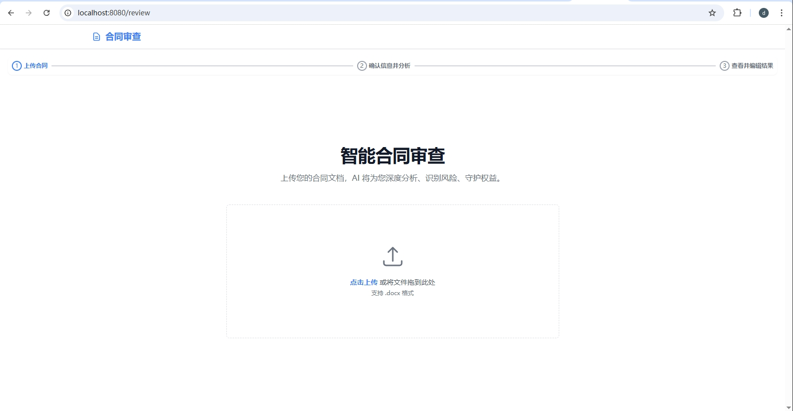
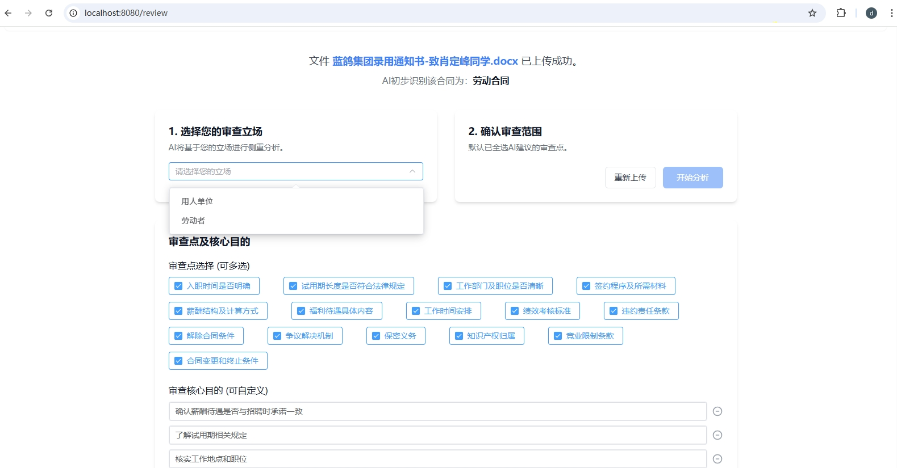
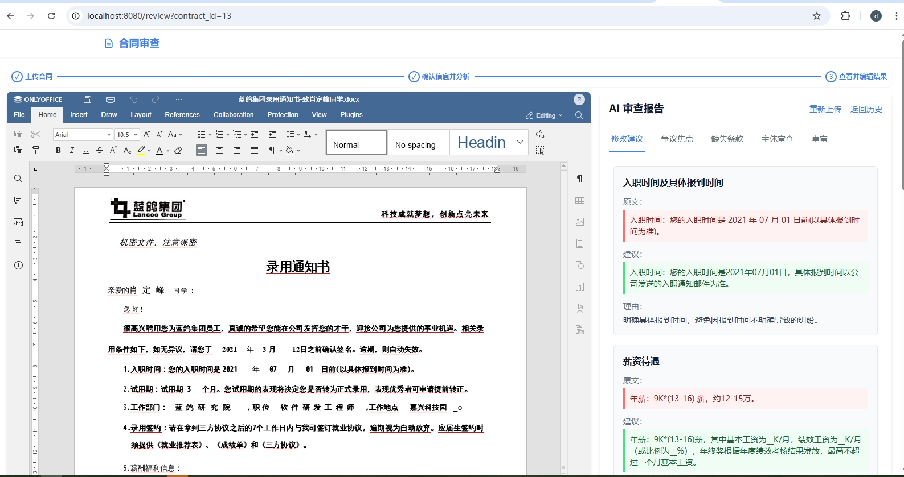
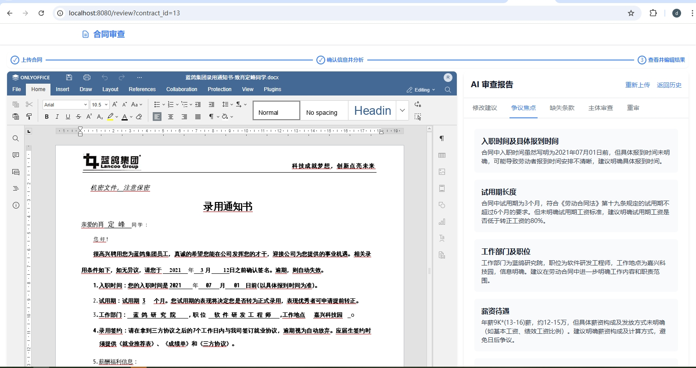
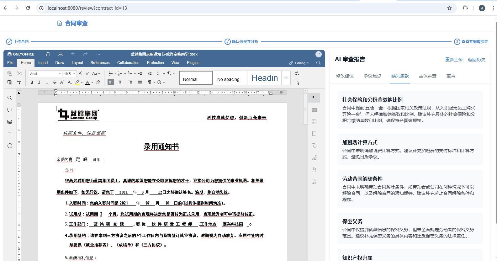
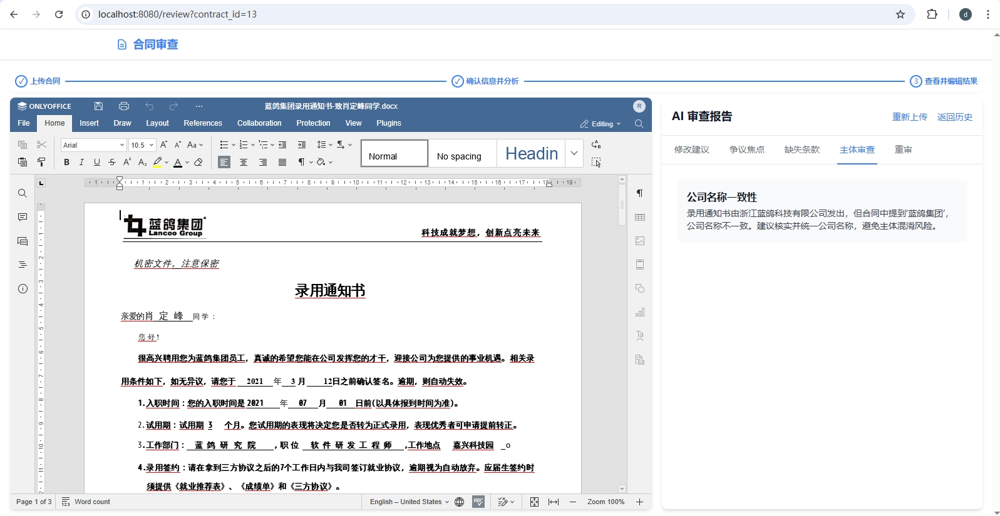
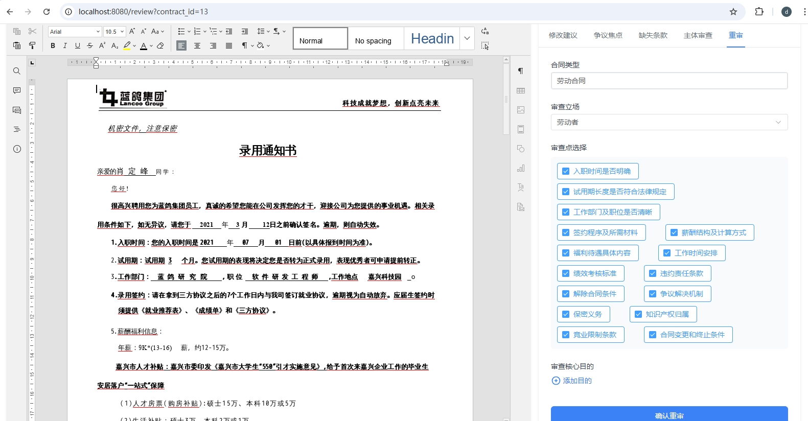

# ContractGE

Contract General Expert - 一款合同审查AI应用 (Contract View)。

## 预览








## 技术栈

- **前端**: Vue 3 + Element UI + TailWind CSS
- **后端**: Node.js + Express
- **数据库**: SQLite
- **office在线**: onlyoffice
- **本地小模型**：deepseek-ai/DeepSeek-R1-0528-Qwen3-8B

## 项目启动

### 启动onlyoffice
> docker run -i -t -d -p 8081:80 -e JWT_ENABLED=true -e JWT_SECRET=3589dfhjjfdgk --restart=always onlyoffice/documentserver


### 1. 启动后端服务

```bash
cd backend
npm install
npm run dev
```
后端服务将运行在 `http://localhost:3000`。

### 2. 启动前端服务

```bash
cd frontend
npm install
npm run serve
```
前端服务将运行在 `http://localhost:8080`。在浏览器中打开此地址即可访问应用。

## 目录结构

```
.
├── backend/                # 后端代码
│   ├── database.js         # 数据库初始化
│   ├── index.js            # Express 服务入口
│   ├── package.json        # 后端依赖
│   └── routes/             # API 路由
│       ├── contracts.js
│       └── qa.js
├── frontend/               # 前端代码
│   ├── public/
│   │   └── index.html
│   ├── src/
│   │   ├── api/            # API 请求封装
│   │   │   └── index.js
│   │   ├── assets/
│   │   ├── components/     # 公共组件
│   │   │   └── Header.vue
│   │   ├── router/         # 路由配置
│   │   │   └── index.js
│   │   ├── views/          # 页面视图
│   │   │   ├── Home.vue
│   │   │   ├── Review.vue
│   │   │   ├── QnA.vue
│   │   │   └── Settings.vue
│   │   ├── App.vue         # 根组件
│   │   └── main.js         # 入口文件
│   └── package.json        # 前端依赖
└── README.md               # 项目说明
``` 
